# Data Structures
Code Challenges are taken out of order in CodeFellows. First five have no code, and Implementation of Data Structures don't aren't required a whiteboard.

Each Challenge will have full description. The Data Structure order is Arrays, Linked List, Hashmap, Binary tree, Binary Search Tree, K-ary tree, Stacks, Queues.
#### **Table of Contents**
----
<table>
  <tr>
    <td> <a href="#challenge01">challenge 1</a></td>
    <td> <a href="#challenge02">challenge 2</a></td>
    <td> <a href="#challenge03">challenge 3</a></td>
    <td> <a href="#challenge04">challenge 4</a></td>
    <td> <a href="#challenge05">challenge 5</a></td>
    <td> <a href="#challenge06">challenge 6</a></td>
    <td> <a href="#challenge07">challenge 7</a></td>
    <td><a href="#challenge08"> challenge 8 </a></td>
  </tr>
  <tr>
    <td><a href="#challenge09"> Interview 9 </a></td>
    <td><a href="#challenge10"> challenge 10 </a></td>
    <td><a href="#challenge11"> challenge 11 </a></td>
    <td><a href="#challenge12"> challenge 12 </a></td>
    <td><a href="#challenge13"> challenge 13 </a></td>
    <td> <a href="#challenge14">challenge 14</a> </td>
    <td> <a href="#challenge15">challenge 15</a> </td>
    <td>  <a href="#challenge16">challenge 16</a>  </td>
  </tr>
  <tr>
    <td>  <a href="#challenge17">challenge 17</a>  </td>
    <td>  <a href="#challenge18">challenge 18</a>  </td>
    <td>  <a href="#challenge19">challenge 19</a>  </td>
    <td>  <a href="#challenge26">challenge 26</a>  </td>
    <td> <a href="#challenge27">challenge 27</a></td>
    <td> <a href="#challenge28">challenge 28</a></td>
    <td> <a href="#challenge29">Interview 29a</a></td>
    <td> <a href="#challenge29">Interview 29b</a></td>
  </tr>
    <td> <a href="#challenge30">challenge 30</a></td>
    <td> <a href="#challenge31">challenge 31</a></td>
    <td> <a href="#challenge32">challenge 32</a></td>
    <td> <a href="#challenge33">challenge 33</a></td>
    <td> <a href="#challenge34">challenge 34</a></td>
    <td> <a href="#challenge35">challenge 35</a></td>
    <td> <a href="#challenge36">challenge 36</a></td>
    <td> <a href="#challenge37">challenge 37</a></td>
  </tr>
  <tr>
    <td> <a href="#challenge39">challenge 39</a></td>
    <td> <a href="#challenge41">challenge 41</a></td>
    <td> <a href="#challenge44">challenge 44</a></td>
    <td> <a href="#challenge42">challenge 42</a></td>
    <td> <a href="#challenge43">challenge 43</a></td>
  </tr>
</table>

Code Challenges
======

## Challenge 01 

### Reverse an Array
- Write a function called reverseArray which takes an array as an argument. Without utilizing any of the built-in methods available to your language, return an array with elements in reversed order.
- Input: An Integer Array
- Output: Same Reversed Integer Array
- [Full Code Description Markdown](Public/Doc/code01.md)

### Whiteboard Process
- [reverse-array Whiteboarding PDF](Public/codechallenge-01.pdf)

### Approach & Efficiency
I knew that going through an array can be done recursively or iteratively.
Further, I knew that no changes to memory since we don't add or remove any element.
Thus, the simplest way to approach this problem was to
implement iteratively by using a while loop and having a temporary
variable to hold a value of either the front or the end of the array.
After I have swapped first and end elements in the array, I would need to then decrement
end and increment front pointers by one. since we only use one loop and n elements of the array
is being traversed
- Time: O(n) because we iterate through full array is worse case and Space: O(1) no extra memory is added per each
iteration
- Location: [ReverseArray](../ReverseArray/ReverseArray.java)
- Method: reverse-array(int [])

## Challenge 02
### Insert and Shift Array
- Write a function called insertShiftArray which takes in an array and a value to be added. Without utilizing any of the built-in methods available to your language, return an array with the new value added at the middle index.
- Input: An Integer Array
- Output: Same Integer Array
- [Full Code Description Markdown](Public/Doc/code02.md)
### Whiteboard Process
[insert-Shift-Array Whiteboarding](Public/codechallenge-02.jpg)

### Approach & Efficiency
After reviewing the barriers of nonrecursive problems and language limitation, I figured the best solution
is to iteratively create a new array with old array contents with target element at the middle of array. once newArray is configured,
I may use the assignment operator(dangerously) to replace old array and return old array (although it would still
just be a new array at the end of day) or just return new array (without the usage of Arraylist - as instructed).
time usage is O(n) because it depends on how long the length of array is and Space is O(1) because we dont iterate through
and add more memory

- Location: [InsertShiftArray](lib/src/main/java/datastructures/array/insertShiftArray/InsertShiftArray.java)
- Test : [InsertShiftArrayTest()](lib/src/test/java/datastructures/array/InsertShiftArrayTest.java)
- Method: insertShiftArray(ArrayList<Integer> x, int toAdd)

### Challenge 03
### Binary Search
- this code searches for an element in array and returns the element index that matches the key.
- input: Integer array and Integer to find
- output an Integer
- [Full Code Description Markdown](Public/Doc/code03.md)
### Whiteboard Process
[Binary-Search Whiteboarding](Public/codechallenge-03.jpg)

### Approach & Efficiency
- By searching bisection method, I was able to avoid usage of creating new objects. So, Space Complexity is O(1). Further, a single iteration is needed to traverse the elements in the array from beginning to N/2 length of array. Thus, the time complexity is O(log(N)).
- Method: binary-search(int []x, int target);

### Challenge 04
- the code adds the sum of each row in the matrix. Then the sum is returned into a new array.
- [Full Description First](Public/Doc/code04a.md)
- Ask the candidate to write a function to accepts an integer, and returns the nth number in the Fibonacci sequence.
- [Full Description Second](Public/Doc/code04b.md)
### Whiteboard Process
- [Sum Matrix Whiteboarding](Public/codechallenge-4a.jpg)
- [Fibonacci Whiteboarding](Public/codechallenge-4b.jpg)

## Approach & Efficiency
- add total sum in matrix :
  - the Time complexity is O(n) and space is O(1);
- fibononacci sequence :
  - Time Complexity is O(N) and Space Complexity O(1)

### Challenge 05 
- Create a linked list and implement Insert, includes, toString
- [Full Description](Public/Doc/code05.md)
### Whiteboard Process
No white board for creating a linked list.
Feature Task 1: Node class that has data type and pointer to itself.
Feature Task 2: Implement Linked list that includes, inserts, and modify a toString method.

## Approach & Efficiency
this insert adds to the beginning of the list: Time O(1), Space O(1).

Includes method checks the list : Time O(N), Space O(1)

- Location: [linkedlist()](lib/src/main/java/datastructures/linkedlist/LinkedList.java)
- Test : [linklistTest()](lib/src/test/java/datastructures/linkedlist/LinkedListTest.java)

## API
- no api was used for this.

## Challenge 6 
### Singly Linked List - appends, insertBefore, insertAfter
- Created a singly linked list that appends, insertBefore, insertAfter.
- [Full Description](Public/Doc/code06.md)

## Approach & Efficiency
- appends adds to the last. I use tail pointer so time here is O(1),
- insert before time complexity is O(N).
- insert after is O(N)
- space is O(N) for all methods to create a temp node with new data.

## API
- no api was used for this.

- [code challenge 6 location](lib/src/main/java/datastructures/linkedlist/LinkedList.java)
- [code challenge 6 test](lib/src/test/java/datastructures/linkedlist/LinkedListTest.java)

# Challenge 7 
## Challenge Summary
- Linked list return the value of the node  length - k in linkedlist.

## Whiteboard Process
No white board needed for process on today's lab. it seemed straight forward. especially iteratively.

## Approach & Efficiency
I solved it just subtracting the length - k and the time complexity is O(n) space O(1)

[Full Description](Public/Doc/code07.md)
## Solution
running libraryTest will run tests. or create a static main and call the function in main.

- [code location](lib/src/main/java/datastructures/linkedlist/LinkedList.java)
- [code challenge test](lib/src/test/java/datastructures/linkedlist/LinkedListTest.java)

# Challenge Summary - 08 
- merges unsorted linked lists and uses iteration.
- [Full Description](Public/Doc/code08.md)
## Whiteboard Process
<!-- Embedded whiteboard image -->

## Approach & Efficiency
- O(n + m) for time complexity since we are iterating two arrays and space complexity of O(1)
## Solution
 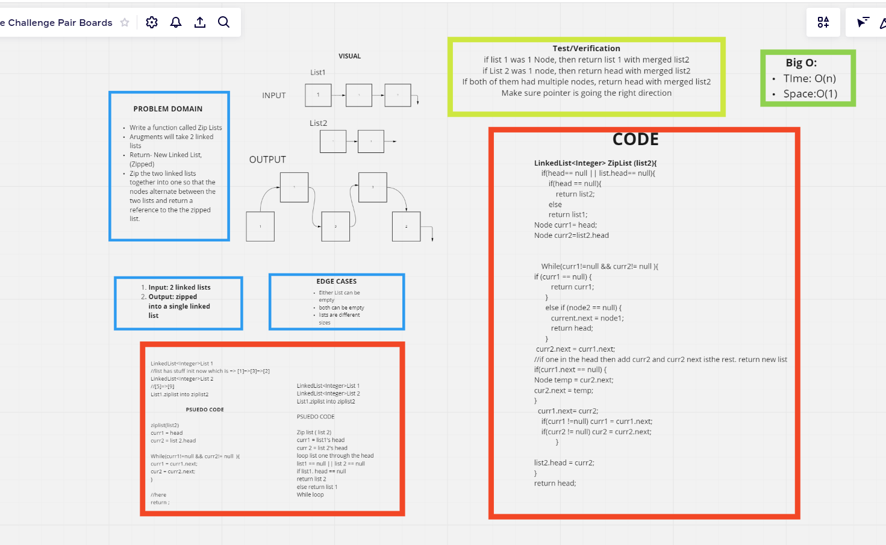
- [code location](lib/src/main/java/datastructures/linkedlist/LinkedList.java)
- [code challenge test](lib/src/test/java/datastructures/linkedlist/LinkedListTest.java)

## Challenge 09 <a name="challenge09">
### Challenge Summary
- 9a reverse a linked list and return the reversed list
- 9b check if linked list is a palindrome
- [Full Description 9a](Public/Doc/code09a.md)
- [Full Description 9b](Public/Doc/code09b.md)
## Whiteboard Process
- [Whiteboard 09a reverse list](Public/codechallenge-9a.jpg)
- [Whiteboard 09a reverse list](Public/codechallenge-9b.jpg)
## Approach & Efficiency
- 9a time O(N) space O(1)
- 9b time O(N) and space O(1)

## Challenge 10 
### Stacks and Queues - 10
- adds a stack using lifo to pop and push, and a queue using enqueue and dequeue method
- [Full Description](Public/Doc/code10.md)
- [code challenge 10 - stack](lib/src/main/java/datastructures/stack/Stack.java)
- [code challenge 10 - queue](lib/src/main/java/datastructures/queue/Queue.java)

## Approach & Efficiency
- Time is O(n^2) since we use two loops for each data structure implementing a pop, push, enqueue, dequeue.
- Space is O(1) because we use memory to create nodes
## API
- no api used

## Challenge Summary - 11 
- Pseudo Queue using Stacks to implement
- [Full Description](Public/Doc/code11.md)
## WhiteBoard Process
-
## Approach & Efficiency
- O(2N^2) using iteration and using pre implemented code, traversing to the end of the stack to remove an item takes N time. However, adding on T1 will have to use two loops
- the first loop will call on another function using pop() and Push() to t2, then inversely add popped items back to t1 from t2.
- time is still O(N) by creation of new memory
- [Code Challenge 11 - PseudoMerge](lib/src/main/java/datastructures/queue/PseudoQueue.java)

## Challenge 12 
### Challenge Summary - 12
- Pseudo Queue using Stacks to implement the Animal Class
- Code Challenge 12
- [Full Description](Public/Doc/code12.md)
## WhiteBoard Process
  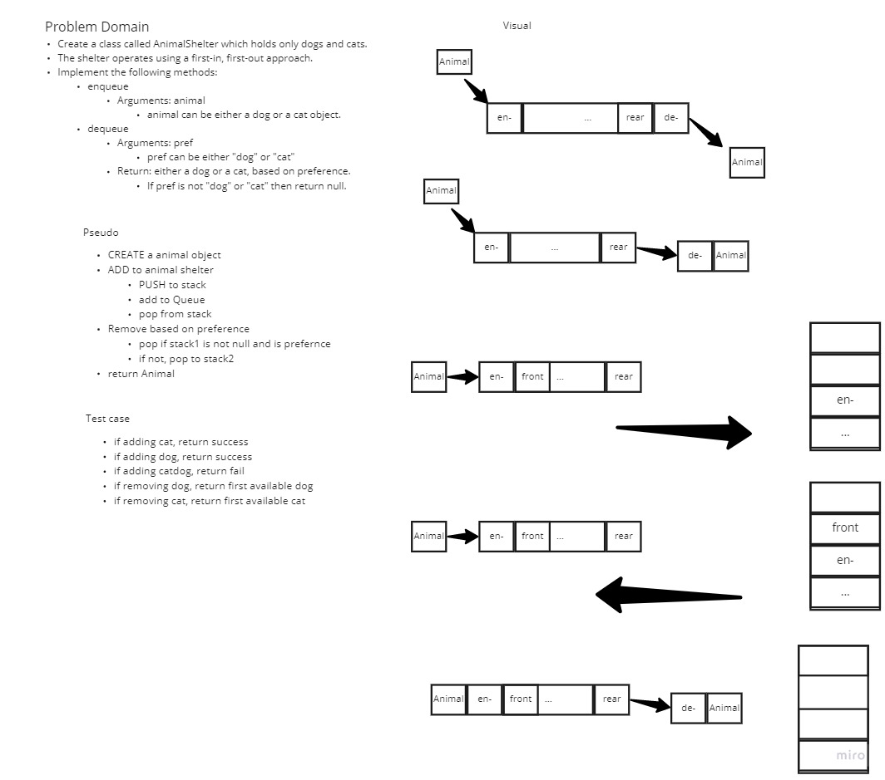
## Approach & Efficiency
- O(2N^2) using iteration and using pre implemented code, traversing to the end of the stack to remove an item takes N time. However, adding on T1 will have to use two loops
- the first loop will call on another function using pop() and Push() to t2, then inversely add popped items back to t1 from t2.
- time is still O(N) by creation of new memory
- [Code Challenge 12 - Animal](lib/src/main/java/datastructures/animal/Animal.java)
- [Code Challenge 12 - AnimalShelter](datastructures/lib/src/main/java/datastructures/animal/AnimalShelter.java)

## Code Challenge 13 
### Challenge Summary
- Write a function called validate brackets
- [Full Description](Public/Doc/code13.md)
- Arguments: string
- Return: boolean representing whether or not the brackets in the string are balanced
## WhiteBoard Process
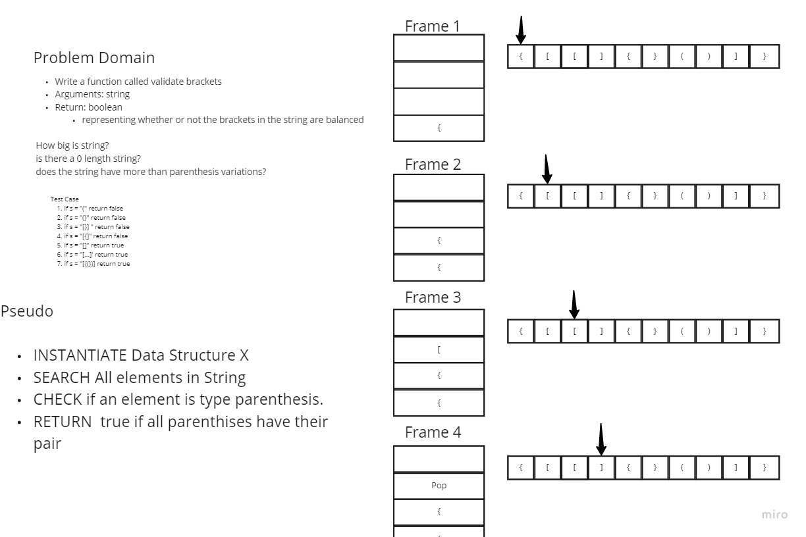
-
## Approach & Efficiency
- I created three different algorithms. a bit more effiecient than the other.
- the final Validate is O(N) and Space O(N)
- using a search algorithm is always traversing to N (length N is dependant on our String passed in thus {1+2+...+N-1})
- since I use only iteration, then O(N) because loop breaks out if N < N-1. thus, O(N) + cO(1) .

- [Code Challenge 13(1) - ValidateParenthesis](lib/src/main/java/datastructures/validatebrackets/ValidateParenth.java)
- [Code Challenge 13(2) - ValidateParenthesis](datastructures/lib/src/main/java/datastructures/validatebrackets/ValidateParenthesis.java)
- [Code Challenge 13(3) - ValidateParenthesis](datastructures/lib/src/main/java/datastructures/validatebrackets/ValidParenth3.java)

## Code Challenge 14 
# Challenge Summary
- Find the max value in node of the Queue
- [Full Description](Public/Doc/code14.md)
## WhiteBoard Process
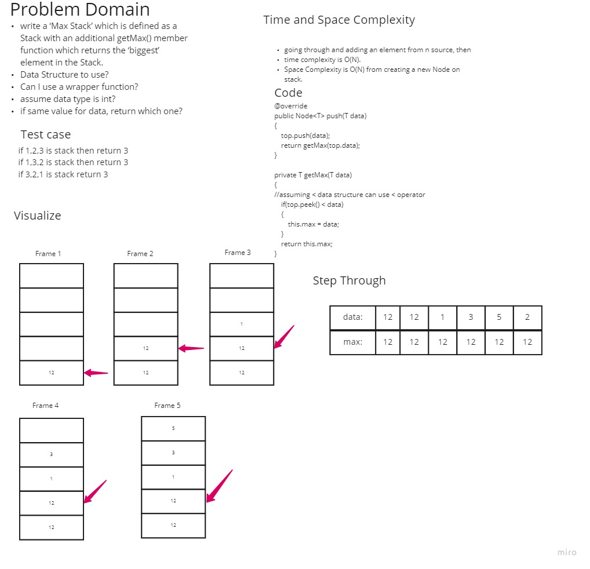
-
## Approach & Efficiency
- data structure only uses one iteration implemented by another function O(N). However, the wrapper function to push will
- do O(1) operations
- therefore, it is O(N) and recreating new nodes is O(N) space

## Code Challenge 15 
### Challenge Summary - 15
- Create a Node and BinaryTree and Binary Search tree that adds and displays preorder, post order, and inorder.
- [Full Description](Public/Doc/code15.md)
## WhiteBoard Process
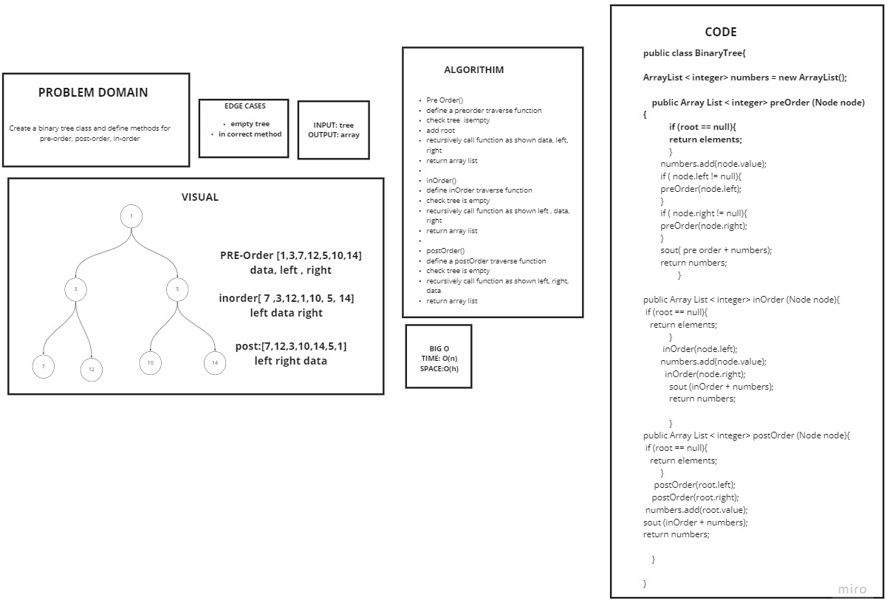
-
## Approach & Efficiency
- data structure only uses one recursive call which O(N). However, some implelmentation using finding and searching takes two recursive calls.
- therefor, it is O(2N) which is O(N)

- [Code Challenge 15 - Tnode](lib/src/main/java/datastructures/tree/Node.java)
- [Code Challenge 15 - BinaryTree](lib/src/main/java/datastructures/tree/BinaryTree.java)
- [Code Challenge 15 - BinarySearchTree](lib/src/main/java/datastructures/tree/BinarySearchTree.java)

## Code Challenge 16 
### Challenge Summary
- Find the maximum value stored in the tree. You can assume that the values stored in the Binary Tree will be numeric
- [Full Description](Public/Doc/code16.md)
## WhiteBoard Process
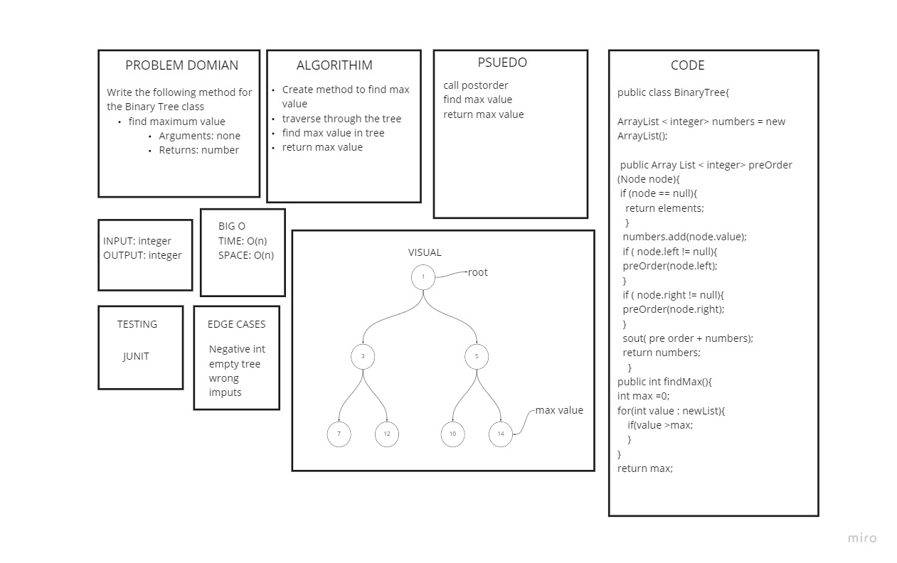

## Approach & Efficiency
- data structure only uses one iteration implemented by another function O(N). However, the wrapper function to push will
- do O(1) operations
- therefore, it is O(N) and recreating new nodes is O(N) space
- [Code Challenge 16 - maxValue()](lib/src/main/java/datastructures/tree/BinaryTree.java)

## Code Challenge 17 
### Challenge Summary
- add to a list by using BreadthFist traversal
- [Full Description](Public/Doc/code17.md)
## WhiteBoard Process
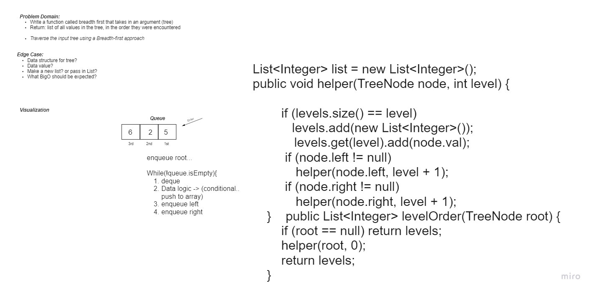
- [Full Description](Public/Doc/code17.md)

## Approach & Efficiency
- data structure only uses one iteration implemented by another function by dequeue we getO(N).
- The traversal by going through the tree to place on the queue is also O(n) since we go throught the entire tree.
- therefore, it time O(N^2) and recreating new nodes is O(N) space
- [Code Challenge 17 - BreadFirst()](lib/src/main/java/datastructures/tree/BinaryTree.java)

## Contributors
- Jason Wilson

## Code Challenge 18 
### Challenge Summary
- Write a function called fizz buzz tree
- [Full Description](Public/Doc/code18.md)
- Arguments: k-ary tree
- Return: new k-ary tree
## WhiteBoard Process
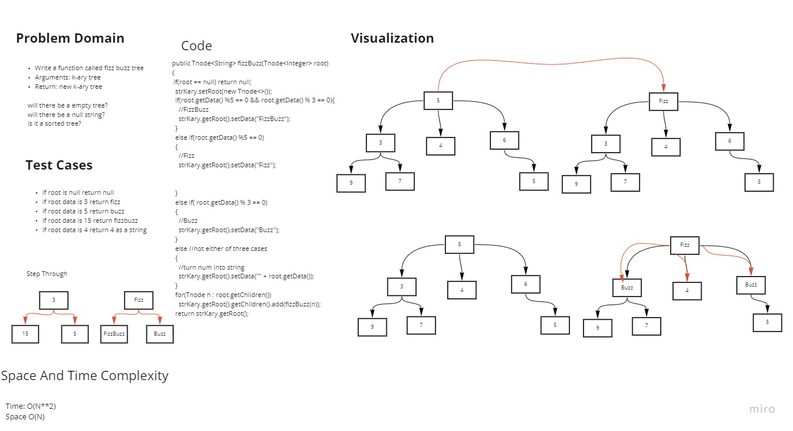

## Approach & Efficiency
- data structure only uses one iteration implemented by another function by dequeue we getO(N).
- The traversal by going through the tree to place on the queue is also O(n) since we go throught the entire tree.
- therefore, it time O(N^2) and recreating new nodes is O(N) space
- [Code Challenge 18 - FizzBuzz()](lib/src/main/java/datastructures/fizzbuzztree/FizzBuzzTree.java)
- [Code Challenge 18 - KaryTree](lib/src/main/java/datastructures/karytree/KaryTree.java)
- [Code Challenge 18 - KaryTree](lib/src/main/java/datastructures/karytree/Tnode.java)
## Contributors
- Jason Wilson

## Code Challenge 19 
### Challenge Summary
- Find the sum of all the odd numbers in a binary search tree.
- [Full Description](Public/Doc/code19.md)
- Any of the traversals (depth or breadth) will work for this
## WhiteBoard Process
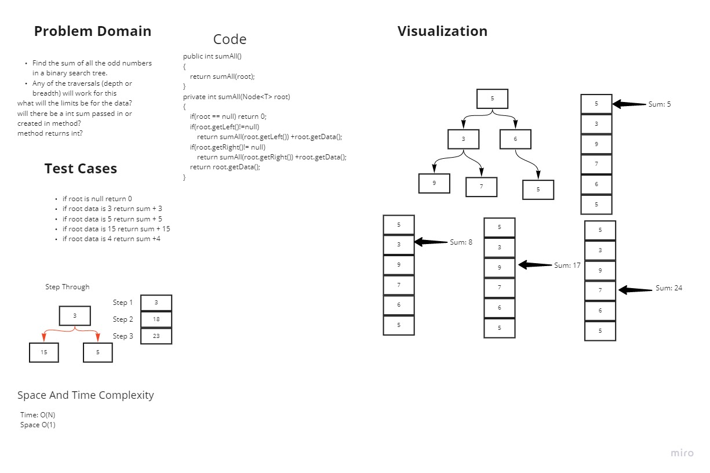

## Approach & Efficiency
- data structure only uses recursion implemented to get through the worst all children. we get O(N).
- no new nodes are created.
- therefore, it time O(N) and recreating new nodes is O(1) space
- [Code Challenge 19 - SumAll](lib/src/main/java/datastructures/tree/SumAll.java)
- [Code Challenge 19 - SumAllTest](lib/src/test/java/datastructures/tree/SumAllTest.java)
## Contributors

## Code Challenge 26 - Insertion Sort 
### Challenge Summary
- sort an unsorted array using insertion sort algorithm
- [Full Description](Public/Doc/code26.md)
## WhiteBoard Process
 - 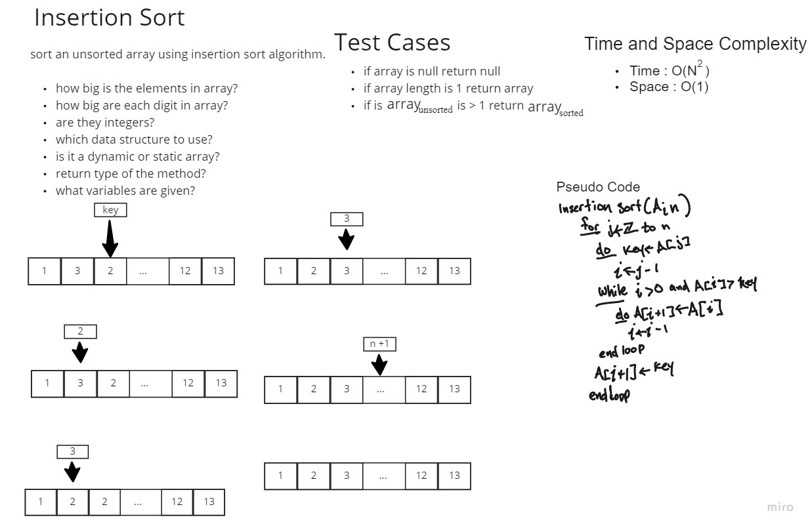
 - [Coded Algorthm](lib/src/main/java/datastructures/array/insertionsort/InsertionSort.java)
 - [Test Algorthm](lib/src/test/java/datastructures/array/InsertionSortTest.java)

## Approach & Efficiency
- Insertion sort asserts everything before the key element is sorted. then traverses the sorted portion and inserts at element where  key is > then before element and > then after element replacing the key with the data at replaced element location.
- this process happens over and over.
- thus, this process uses two loops to iterate. one for iterating N elements and the other to travers sorted portion of array.
- next we have constant time variables and nothing new is created.
- thus, the time complexity Big O is O(N^2) and worst space complexity is O(1)
- 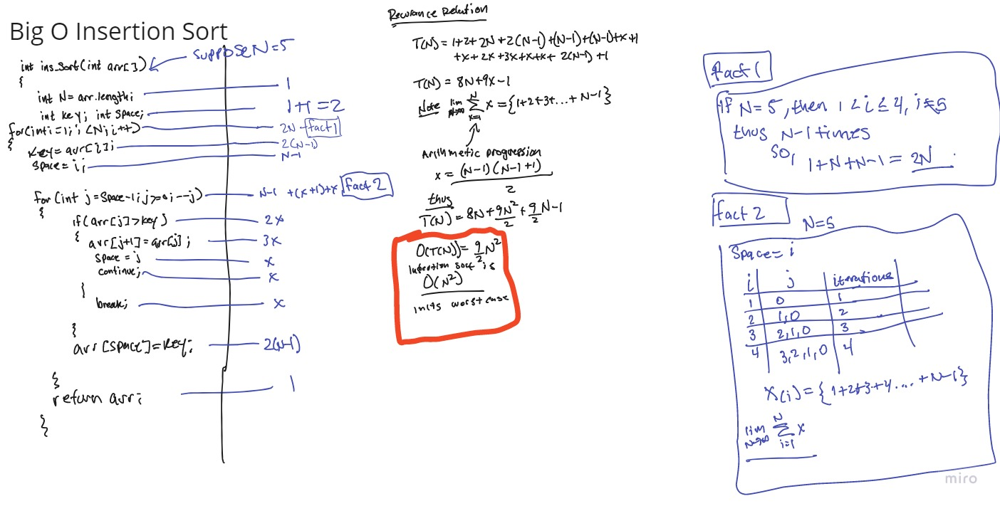
## Contributors

## Code Challenge 27 - Merge Sort 
### Challenge Summary
- sort an unsorted array using merge sort algorithm
- [Full Description](Public/Doc/code27.md)
## WhiteBoard Process
- 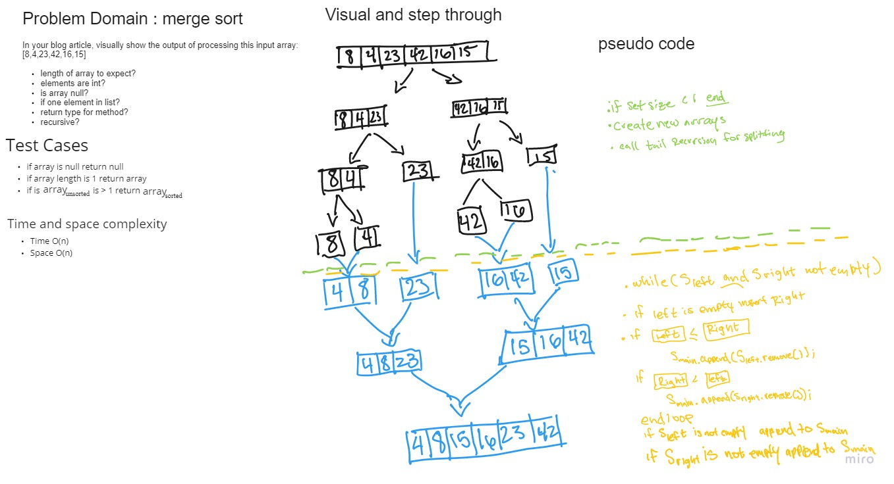
- [Coded Algorthm](lib/src/main/java/datastructures/array/mergesort/MergeSort.java)
- [Test Algorthm](lib/src/test/java/datastructures/array/MergeSortTest.java)

## Approach & Efficiency
- the process of this code is to create new arrays left and right. then after reaching n amount of arrays
- this process happens over and over.
- then after all is split, into an individual array, the sorting process happens. this takes length of n times for worst case.
- thus, this process uses N amount of space and we also have N time taken as the recusive call unwinds to compare elements.
- thus, the time complexity Big O is O(N*logn) and worst space complexity is O(N)
## Contributors

## Code Challenge 28 - Quick Sort 
### Challenge Summary
- sort an unsorted array using Quick sort algorithm
- [Full Description](Public/Doc/code28.md)
## WhiteBoard Process
- 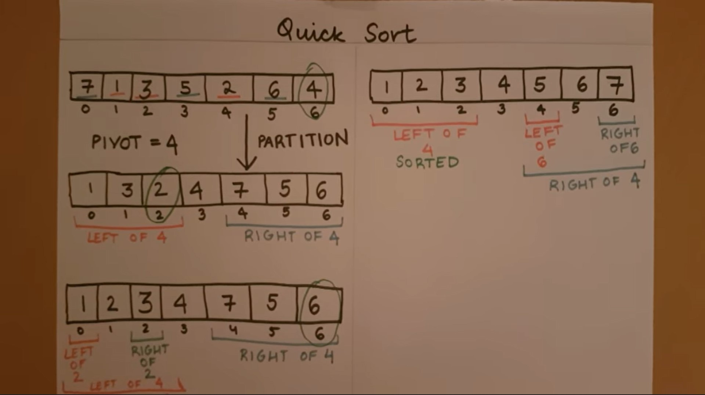
## Approach & Efficiency
Time O(N^2) Space O(1)

## Code Challenge 29 
### Challenge Summary
- sort an unsorted array using merge sort algorithm
- [Full Description 29a](Public/Doc/code29a.md)
- sort an unsorted array using quicksort algorithm
- [Full Description 29b](Public/Doc/code29b.md)
## WhiteBoard Process
- 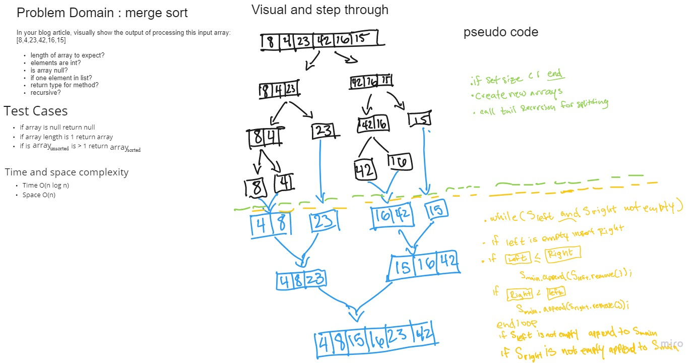
- 
- [Coded Algorthm 29a](lib/src/main/java/datastructures/array/mergesort/MergeSort.java)
- [Test Algorthm 29a](lib/src/test/java/datastructures/array/MergeSortTest.java)
## Approach & Efficiency
## Contributors

## Challenge Challenge 30 - Hashtables Abstract Data Type 
### Challenge Summary
- [Full Description](Public/Doc/code30.md)
- implementing the class Hashtable
### Features:
- set
  - Arguments: key, value
  - Returns: nothing
  - This method should hash the key, and set the key and value pair in the table, handling collisions as needed.
  - Should a given key already exist, replace its value from the value argument given to this method.
- get
  - Arguments: key
  - Returns: Value associated with that key in the table
  - contains
  - Arguments: key
  - Returns: Boolean, indicating if the key exists in the table already.
- keys
  - Returns: Collection of keys
- hash
  - Arguments: key
  - Returns: Index in the collection for that key
## Challenge
<!-- Description of the challenge -->
- this code focuses on the data structure HashTable from scratch. it is useful to know
- how this code is implemented.

### Whiteboarding
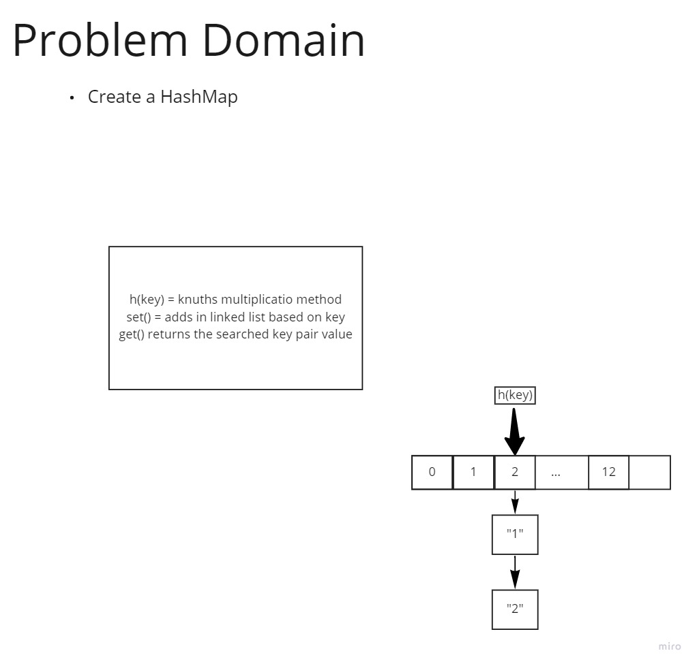

[Coded Algorthm](lib/src/main/java/datastructures/hashtablessecond/HashMap.java)
[Test Algorthm](lib/src/test/java/datastructures/hashtable/HashMapSecondTest.java)
## Approach & Efficiency
- one to many
- using linked list seems to be the best case for a generic case. to store in bucket.
  - Simple Unifomity - each key is equally liekly to be hashed to any slot of the table. independant of where other keys hasing.
  - analysis load factor λ is the n keys / slots in bucket and  λ < 1.
- Worst case time complexity is O(N) because if all map to a single element in bucket, then searching is O(N)
  - however, adding will be added to beginning or end of list which is O(1)
- Worst case space complexity is only O(N) when adding a new value into linked list.
- universal hashing for hasing(key) - hashing(key) = a*k+b mod prime mod m where prime > Universe
  - this is best because worst case key1 != key2 is that will collide probability is 1/N which is good.

## API
<!-- Description of each method publicly available in each of your hashtable -->
- I have a wrapper with no arguments that gets called for method that does things for data structure
- a toString is overriden to display contents.
- uses Hashing method to create a value with the input of key.
- [Coded Algorthm](lib/src/main/java/datastructures/hashtables/hashtable/HashMap.java)
- [Coded Algorthm 2](lib/src/main/java/datastructures/hashtables/hashtable/HashMapPair.java)
- [Test Algorthm](lib/src/test/java/datastructures/hashtables/hashtable/HashMapTest.java)

## Code Challenge 31 
### Challenge Summary
- Finds the first word to occur more than onece in a  string
- input : String
- output : String
- [Full Description 31](Public/Doc/code31.md)
## WhiteBoard Process
- 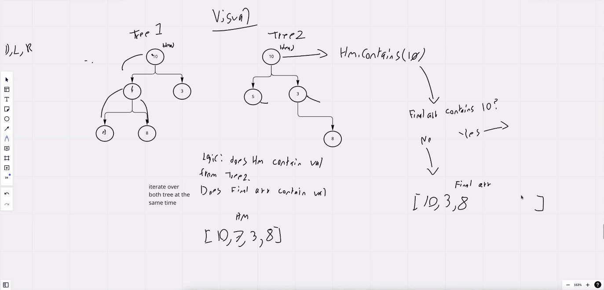
- [Coded Algorthm](lib/src/main/java/datastructures/hashtables/RepeatedWord.java)
## Approach & Efficiency
- Time O(n) space O(N^2)
## Contributors

## Code Challenge 32 
### Challenge Summary
- Find common values in 2 binary trees.
- [Full Description 32](Public/Doc/code32.md)
## WhiteBoard Process
- 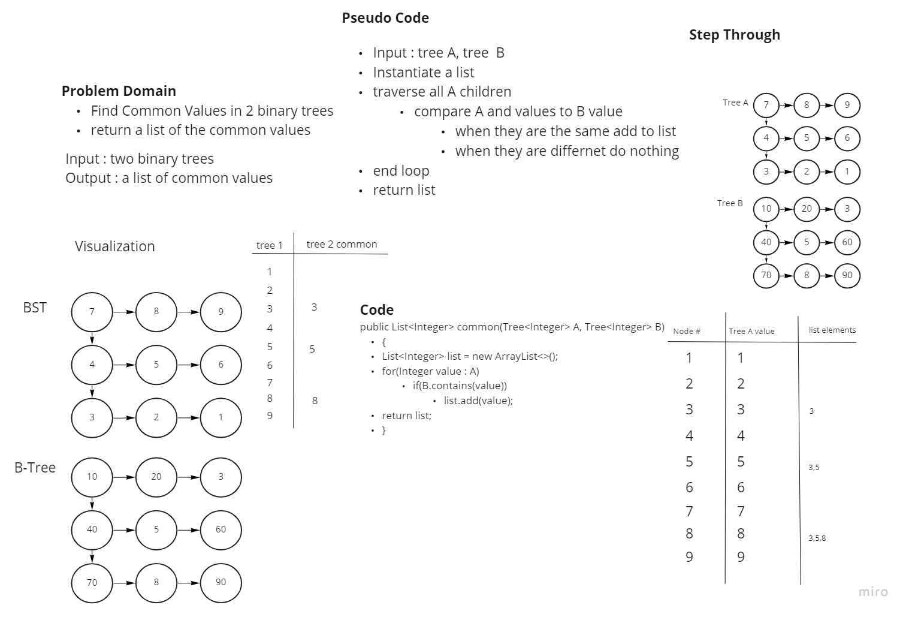
- [Coded Algorthm](lib/src/main/java/datastructures/tree_intersection/TreeIntersection.java)
- [Test Algorthm](lib/src/test/java/datastructures/tree/BinaryTreeTest.java)
## Approach & Efficiency
- Time O(N ^ 2 ) with recursion approach but O(N)
- Space O(N)
## Contributors

## Code Challenge 33 
### Challenge Summary
- Implement a simplified LEFT JOIN for 2 Hashmaps.
- [Full Description 33](Public/Doc/code33.md)
## WhiteBoard Process
- 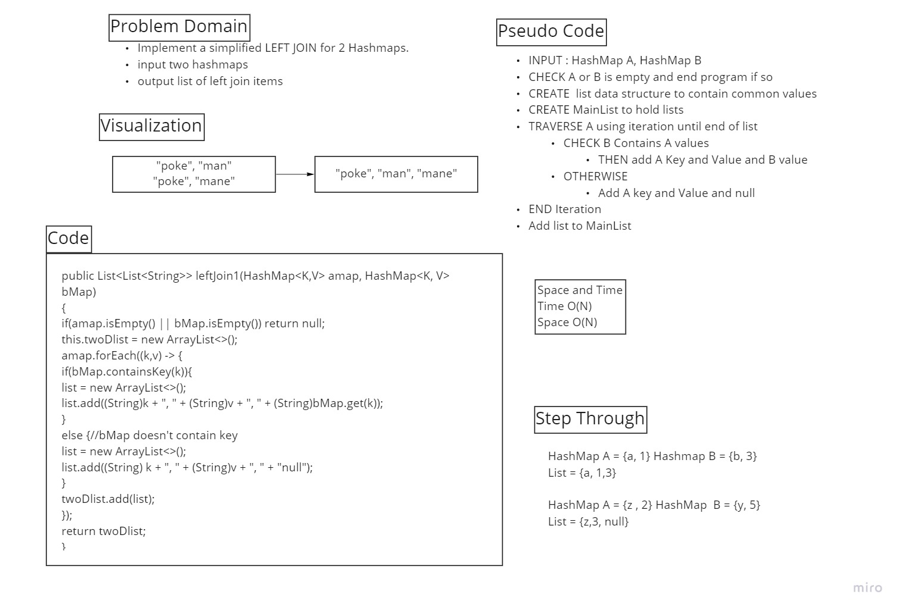
- [Coded Algorthm](lib/src/main/java/datastructures/leftjoin/LeftJoin.java)
- [Test Algorthm](lib/src/test/java/datastructures/hashtable/LeftJoinTest.java)
## Approach & Efficiency
Time O(N) Space O(N)
## Contributors

## Code Challenge 34 
### Challenge Summary
- [Full Description 34a](Public/Doc/code34a.md)
  - Determine the most common word in a book.
- [Full Description 34b](Public/Doc/code34b.md)
  - Determine if a string is full of unique characters
  - Stretch goal is included in code
## WhiteBoard Process
- 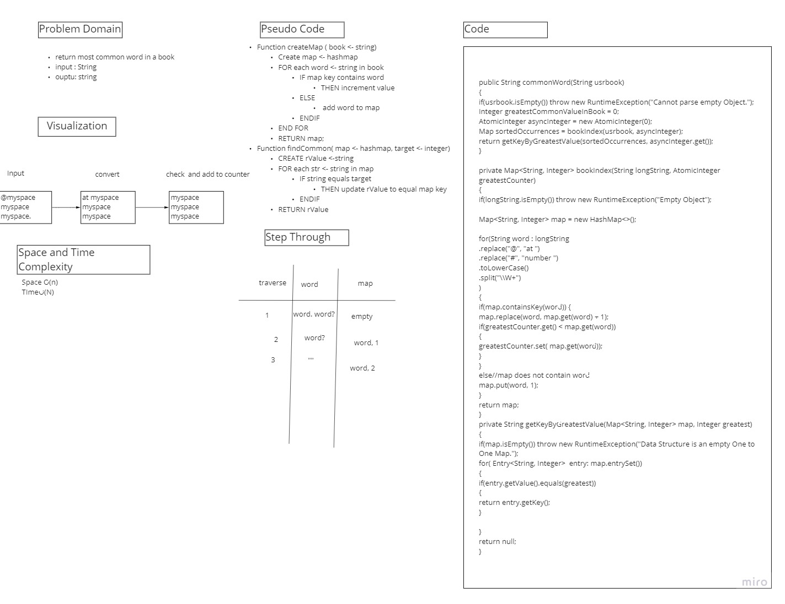
- 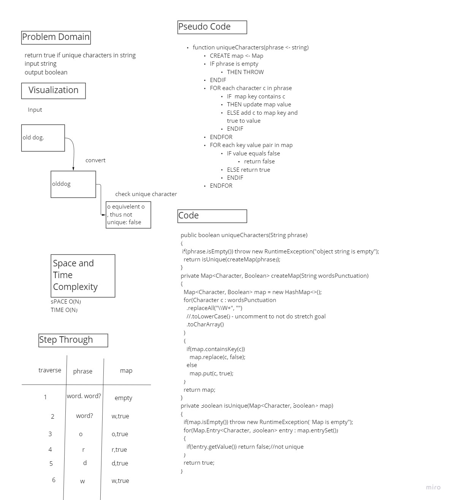
- [Coded Algorithm 34a](lib/src/main/java/datastructures/commonword/CommonWord.java)
- [Test Algorthm 34a](lib/src/test/java/datastructures/hashtable/CommonWordTest.java)
- [Coded Algorithm 34b](lib/src/main/java/datastructures/uniquecharacters/UniqueCharacters.java)
- [Test Algorthm 34b](lib/src/test/java/datastructures/hashtable/UniqueCharactersTest.java)
## Approach & Efficiency
- Both: Time O(N) Space O(N)
## Contributors

## Code Challenge 35 
### Challenge Summary
- Implement a graph
  - add node
  - add edge
  - get nodes
  - get neighbors
  - size 
- [Full Description 35](Public/Doc/code35.md)
## WhiteBoard Process
- [Coded Algorthm](lib/src/main/java/datastructures/graphs/Graphs.java)
- [Test Algorthm](lib/src/test/java/datastructures/graphs/GraphTest.java)
## Approach & Efficiency
- 
## Contributors

## Code Challenge 36 
### Challenge Summary
- implement breadth first graph
- [Full Description 36](Public/Doc/code36.md)
- [Coded Algorthm](lib/src/main/java/datastructures/graphs/Graphs.java)
- [Test Algorthm](lib/src/test/java/datastructures/graphs/GraphTest.java)
## WhiteBoard Process
## Approach & Efficiency
## Contributors

## Code Challenge 37 
### Challenge Summary
- sort an unsorted array using merge sort algorithm
- [Full Description 37](Public/Doc/code37.md)
## WhiteBoard Process
- 
- [Coded Algorthm](lib/src/main/java/datastructures)
- [Test Algorthm](lib/src/test/java/datastructures/array)
## Approach & Efficiency
## Contributors

## Code Challenge 39 
### Challenge Summary
- sort an unsorted array using merge sort algorithm
- [Full Description 39](Public/Doc/code39.md)
## WhiteBoard Process
- 
- [Coded Algorthm](lib/src/main/java/datastructures)
- [Test Algorthm](lib/src/test/java/datastructures/array)
## Approach & Efficiency
## Contributors

## Code Challenge 41 
### Challenge Summary
- sort an unsorted array using merge sort algorithm
- [Full Description 41](Public/Doc/code41.md)
## WhiteBoard Process
- 
- [Coded Algorthm](lib/src/main/java/datastructures)
- [Test Algorthm](lib/src/test/java/datastructures/array)
## Approach & Efficiency
## Contributors

## Code Challenge 42 
### Challenge Summary
- sort an unsorted array using merge sort algorithm
- [Full Description 42](Public/Doc/code42.md)
## WhiteBoard Process
- 
- [Coded Algorthm](lib/src/main/java/datastructures)
- [Test Algorthm](lib/src/test/java/datastructures/array)
## Approach & Efficiency
## Contributors

## Code Challenge 43 
### Challenge Summary
- sort an unsorted array using merge sort algorithm
- [Full Description 43](Public/Doc/code43.md)
## WhiteBoard Process
- 
- [Coded Algorthm](lib/src/main/java/datastructures)
- [Test Algorthm](lib/src/test/java/datastructures/array)
## Approach & Efficiency
## Contributors

## Code Challenge 44 
### Challenge Summary
- sort an unsorted array using merge sort algorithm
- [Full Description 44](Public/Doc/code44.md)
## WhiteBoard Process
- 
- [Coded Algorthm](lib/src/main/java/datastructures)
- [Test Algorthm](lib/src/test/java/datastructures/array)
## Approach & Efficiency
## Contributors

