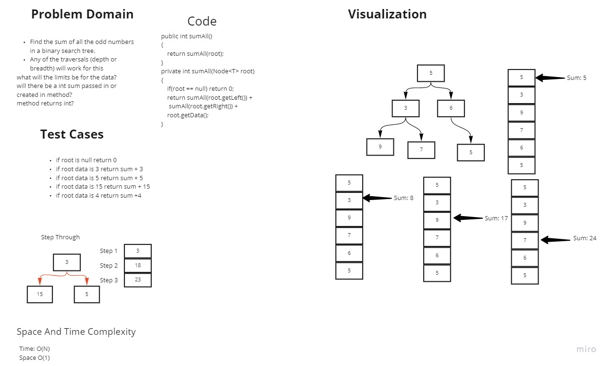

# Data Structures

## Implementation Notes

## Code Challenges

## Table of Contents
- [challenge 1](#challenge01)
- [challenge 2](#challenge02)
- [challenge 3](#challenge03)
- [challenge 4a](#challenge04a)
- [challenge 4b](#challenge04b)
- [challenge 5](#challenge05)
- [challenge 6](#challenge06)
- [challenge 7](#challenge07)
- [challenge 8](#challenge08)
- [challenge 9](#challenge09)
- [challenge 10](#challenge10)
- [challenge 11](#challenge11)
- [challenge 12](#challenge12)
- [challenge 13](#challenge13)
- [challenge 14](#challenge14)
- [challenge 15](#challenge15)
- [challenge 16](#challenge16)
- [challenge 17](#challenge17)
- [challenge 18](#challenge18)
- [challenge 19](#challenge19)
- [Insertion Sort](#challenge26)
- [Merge Sort](#challenge27)
- [Quick Sort](#challenge28)
- [Interview 29a](#challenge29a)
- [Interview 29b](#challenge29b)
- [challenge 30](#challenge30)
- [challenge 31](#challenge31)
- [challenge 32](#challenge32)
- [challenge 33](#challenge33)
- [challenge 34](#challenge34)
- [challenge 35](#challenge35)
- [challenge 36](#challenge36)
- [challenge 37](#challenge37)
- [challenge 39](#challenge39)
- [challenge 41](#challenge41)
- [challenge 44](#challenge44)
- [challenge 42](#challenge42)
- [challenge 43](#challenge43)
<dl>
  <dt>Lower cost</dt>
  <dd>The new version of this product costs significantly less than the previous one!</dd>
  <dt>Easier to use</dt>
  <dd>We've changed the product so that it's much easier to use!</dd>
</dl>

ID | Name | Rank
-- | ---- | ----
1 | Tom Preston-Werner | Awesome
2 | Albert Einstein | Nearly as awesome

<ol style="list-style-type:decimal; width: 600px;">
    <li style="float: left; width: 200px; padding: 2px 0px;">Test1</li>
    <li style="float: left; width: 200px; padding: 2px 0px;">Test2</li>
    <li style="float: left; width: 200px; padding: 2px 0px;">Test3</li>
</ol>

## Challenge 01 

### Reverse an Array
- Write a function called reverseArray which takes an array as an argument. Without utilizing any of the built-in methods available to your language, return an array with elements in reversed order.

### Whiteboard Process
[reverse-array Whiteboarding](Public/reverse-array.pdf)

### Approach & Efficiency
I knew that going through an array can be done recursively or iteratively.
Further, I knew that no changes to memory since we don't add or remove any element.
Thus, the simplest way to approach this problem was to
implement iteratively by using a while loop and having a temporary
variable to hold a value of either the front or the end of the array.
After I have swapped first and end elements in the array, I would need to then decrement
end and increment front pointers by one. since we only use one loop and n elements of the array
is being traversed
- Time: O(n) because we iterate through full array is worse case and Space: O(1) no extra memory is added per each
iteration
- Location: 'codechallenges/Reverse-Array/reverse-array'
- Method: reverse-array(int []);

### Challenge 02
### Whiteboard Process
[insert-Shift-Array Whiteboarding](Public/codechallenge2.pdf)

### Approach & Efficiency
After reviewing the barriers of nonrecursive problems and language limitation, I figured the best solution
is to iteratively create a new array with old array contents with target element at the middle of array. once newArray is configured,
I may use the assignment operator(dangerously) to replace old array and return old array (although it would still
just be a new array at the end of day) or just return new array (without the usage of Arraylist - as instructed).
time usage is O(n) because it depends on how long the length of array is and Space is O(1) because we dont iterate through
and add more memory

- Location: 'codechallenges/insertShift/insertShiftArray'
- Method: insertShiftArray(int []x);

### Challenge 03
### Whiteboard Process
[Binary-Search Whiteboarding](Public/binary-search.jpg)

## Approach & Efficiency
this code searches for an element in array and returns the element index that matches the key.
- worked with Jason Wilson
- Location: 'codechallenges/binary-search/binary-search.jpg'
- Method: binary-search(int []x, int target);

### Challenge 04
### Whiteboard Process
[Binary-Search Whiteboarding](Public/binary-search.jpg)

## Approach & Efficiency
this code searches for an element in array and returns the element index that matches the key.
- worked with Jason Wilson
- Location: 'codechallenges/binary-search/binary-search.jpg'
- Method: binary-search(int []x, int target);

### Challenge 05 
### Whiteboard Process
[AddSum WhiteBoarding](Public/AddSum.jpg)
## Approach & Efficiency
- the code adds the sum of each row in the matrix. Then the sum is returned into a new array.
- the Time complexity is O(n) and space is O(1);

# Singly Linked List - Insert, toString, includes
- Created a singly linked list that inserts, Overrides toString, includes

## Challenge
- Code challenge 5 is intended to focus on implementation of Node class, and lInked list

## Approach & Efficiency
- I focused on using linked list for these implementations. especially insertion of a initial list.
- recursion wasn't as efficient. since insertion at the beginning is relatively fast, then O(n) was used
- space was O(1)

## API
- no api was used for this.

- [code challenge 5 location](app/src/main/java/linked/list)
# Singly Linked List - appends, insertBefore, insertAfter
- Created a singly linked list that appends, insertBefore, insertAfter.

## Challenge
- Code challenge 6 is intended to focus on implementation of insertion when traversing a list. the difficulty was to insert at beginning, middle, and end.
- recursion could have been used here but not needed.

## Approach & Efficiency
- I focused on using linked list for these implementations. especially insertion of a initial list.
- recursion wasn't as efficient. since insertion at the beginning is relatively fast, then O(n) was used
- space was O(1)

## API
- no api was used for this.

- [code challenge 6 location](app/src/main/java/linked/list)

# Challenge Summary
- Linked list return the value of the node  length - k in linkedlist.

## Whiteboard Process
No white board needed for process on today's lab. it seemed straight forward. especially iteratively.

## Approach & Efficiency
I solved it just subtracting the length - k and the time complexity is O(n) space O(1)
## Solution
running libraryTest will run tests. or create a static main and call the function in main.

- [code location](app/src/main/java/linked/list)

# Challenge Summary - 08
- merges unsorted linked lists and uses iteration.
## Whiteboard Process
<!-- Embedded whiteboard image -->

## Approach & Efficiency
- O(n + m) for time complexity since we are iterating two arrays and space complexity of O(1)
## Solution
- run test cases in case 1 and many
 
- [code challenge 08 location](app/src/main/java/linked/list)

# Stacks and Queues - 10
- adds a stack using lifo to pop and push, and a queue using enqueue and dequeue method
## Challenge
- [code challenge 10 - stack](../datastructures/lib/src/main/java/datastructures/stack/Stack.java)
- [code challenge 10 - queue](../datastructures/lib/src/main/java/datastructures/queue/Queue.java)
## Approach & Efficiency
- Time is O(n^2) since we use two loops for each data structure implementing a pop, push, enqueue, dequeue.
- Space is O(1) because we use memory to create nodes
## API
- no api used

#Challenge Summary - 11
- Pseudo Queue using Stacks to implement
- Code Challenge 11
## WhiteBoard Process
-
## Approach & Efficiency
- O(2N^2) using iteration and using pre implemented code, traversing to the end of the stack to remove an item takes N time. However, adding on T1 will have to use two loops
- the first loop will call on another function using pop() and Push() to t2, then inversely add popped items back to t1 from t2.
- time is still O(N) by creation of new memory
- [Code Challenge 11 - PseudoMerge](../datastructures/lib/src/main/java/datastructures/queue/PseudoQueue.java)

#Challenge Summary - 12
- Pseudo Queue using Stacks to implement the Animal Class
- Code Challenge 12
## WhiteBoard Process
  
## Approach & Efficiency
- O(2N^2) using iteration and using pre implemented code, traversing to the end of the stack to remove an item takes N time. However, adding on T1 will have to use two loops
- the first loop will call on another function using pop() and Push() to t2, then inversely add popped items back to t1 from t2.
- time is still O(N) by creation of new memory
- [Code Challenge 12 - Animal](../datastructures/lib/src/main/java/datastructures/animal/Animal.java)
- [Code Challenge 12 - AnimalShelter](../datastructures/lib/src/main/java/datastructures/animal/AnimalShelter.java)

#Challenge Summary - 13
- Write a function called validate brackets
- Arguments: string
- Return: boolean representing whether or not the brackets in the string are balanced
## WhiteBoard Process

-
## Approach & Efficiency
- I created three different algorithms. a bit more effiecient than the other.
- the final Validate is O(N) and Space O(N)
- using a search algorithm is always traversing to N (length N is dependant on our String passed in thus {1+2+...+N-1})
- since I use only iteration, then O(N) because loop breaks out if N < N-1. thus, O(N) + cO(1) .

- [Code Challenge 13(1) - ValidateParenthesis](../datastructures/lib/src/main/java/datastructures/validatebrackets/ValidateParenth.java)
- [Code Challenge 13(2) - ValidateParenthesis](../datastructures/lib/src/main/java/datastructures/validatebrackets/ValidateParenthesis.java)
- [Code Challenge 13(3) - ValidateParenthesis](../datastructures/lib/src/main/java/datastructures/validatebrackets/ValidParenth3.java)

#Challenge Summary -15
- Create a Node and BinaryTree and Binary Search tree that adds and displays preorder, post order, and inorder
## WhiteBoard Process

-
## Approach & Efficiency
- data structure only uses one recursive call which O(N). However, some implelmentation using finding and searching takes two recursive calls.
- therefor, it is O(2N) which is O(N)

- [Code Challenge 15 - Tnode](../datastructures/lib/src/main/java/datastructures/tree/Node.java)
- [Code Challenge 15 - BinaryTree](../datastructures/lib/src/main/java/datastructures/tree/BinaryTree.java)
- [Code Challenge 15 - BinarySearchTree](../datastructures/lib/src/main/java/datastructures/tree/BinarySearchTree.java)

#Challenge Summary - 14
- Find the max value in node of the Queue
## WhiteBoard Process

-
## Approach & Efficiency
- data structure only uses one iteration implemented by another function O(N). However, the wrapper function to push will
- do O(1) operations
- therefore, it is O(N) and recreating new nodes is O(N) space

#Challenge Summary - 16
- Find the maximum value stored in the tree. You can assume that the values stored in the Binary Tree will be numeric
## WhiteBoard Process

## Approach & Efficiency
- data structure only uses one iteration implemented by another function O(N). However, the wrapper function to push will
- do O(1) operations
- therefore, it is O(N) and recreating new nodes is O(N) space
- [Code Challenge 16 - maxValue()](../datastructures/lib/src/main/java/datastructures/tree/BinaryTree.java)

#Challenge Summary - 17
- add to a list by using BreadthFist traversal
## WhiteBoard Process

## Approach & Efficiency
- data structure only uses one iteration implemented by another function by dequeue we getO(N).
- The traversal by going through the tree to place on the queue is also O(n) since we go throught the entire tree.
- therefore, it time O(N^2) and recreating new nodes is O(N) space
- [Code Challenge 17 - BreadFirst()](../datastructures/lib/src/main/java/datastructures/tree/BinaryTree.java)

## Contributors
- Jason Wilson

#Challenge Summary - 18
- Write a function called fizz buzz tree
  Arguments: k-ary tree
  Return: new k-ary tree
## WhiteBoard Process

## Approach & Efficiency
- data structure only uses one iteration implemented by another function by dequeue we getO(N).
- The traversal by going through the tree to place on the queue is also O(n) since we go throught the entire tree.
- therefore, it time O(N^2) and recreating new nodes is O(N) space
- [Code Challenge 18 - FizzBuzz()](../datastructures/lib/src/main/java/datastructures/fizzbuzztree/FizzBuzzTree.java)
- [Code Challenge 18 - KaryTree](../datastructures/lib/src/main/java/datastructures/karytree/KaryTree.java)
- [Code Challenge 18 - KaryTree](../datastructures/lib/src/main/java/datastructures/karytree/Tnode.java)
## Contributors
- Jason Wilson

#Challenge Summary - 19
- Find the sum of all the odd numbers in a binary search tree.
- Any of the traversals (depth or breadth) will work for this
## WhiteBoard Process

## Approach & Efficiency
- data structure only uses recursion implemented to get through the worst all children. we get O(N).
- no new nodes are created.
- therefore, it time O(N) and recreating new nodes is O(1) space
- [Code Challenge 19 - SumAll](../datastructures/lib/src/main/java/datastructures/tree/SumAll.java)
- [Code Challenge 19 - SumAllTest](../datastructures/lib/src/test/java/datastructures/tree/SumAllTest.java)
## Contributors

# Challenge Summary - Insertion Sort 
- sort an unsorted array using insertion sort algorithm
## WhiteBoard Process
 - 
 - [Coded Algorthm](lib/src/main/java/datastructures/array/insertionsort/InsertionSort.java)
 - [Test Algorthm](lib/src/test/java/datastructures/array/InsertionSortTest.java)

## Approach & Efficiency
- Insertion sort asserts everything before the key element is sorted. then traverses the sorted portion and inserts at element where  key is > then before element and > then after element replacing the key with the data at replaced element location.
- this process happens over and over.
- thus, this process uses two loops to iterate. one for iterating N elements and the other to travers sorted portion of array.
- next we have constant time variables and nothing new is created.
- thus, the time complexity Big O is O(N^2) and worst space complexity is O(1)
- 
## Contributors

# Challenge Summary - Merge Sort 
- sort an unsorted array using merge sort algorithm
## WhiteBoard Process
- 
- [Coded Algorthm](lib/src/main/java/datastructures/array/mergesort/MergeSort.java)
- [Test Algorthm](lib/src/test/java/datastructures/array/MergeSortTest.java)

## Approach & Efficiency
- the process of this code is to create new arrays left and right. then after reaching n amount of arrays
- this process happens over and over.
- then after all is split, into an individual array, the sorting process happens. this takes length of n times for worst case.
- thus, this process uses N amount of space and we also have N time taken as the recusive call unwinds to compare elements.
- thus, the time complexity Big O is O(N*logn) and worst space complexity is O(N)
## Contributors

# Challenge Summary - Hashtables Abstract Data Type 
- implementing the class Hashtable
###Features:
- set
  - Arguments: key, value
  - Returns: nothing
  - This method should hash the key, and set the key and value pair in the table, handling collisions as needed.
  - Should a given key already exist, replace its value from the value argument given to this method.
- get
  - Arguments: key
  - Returns: Value associated with that key in the table
  - contains
  - Arguments: key
  - Returns: Boolean, indicating if the key exists in the table already.
- keys
  - Returns: Collection of keys
- hash
  - Arguments: key
  - Returns: Index in the collection for that key
## Challenge
<!-- Description of the challenge -->
- this code focuses on the data structure HashTable from scratch. it is useful to know
- how this code is implemented.

###Whiteboarding

## Approach & Efficiency
- one to many
- using linked list seems to be the best case for a generic case. to store in bucket.
  - Simple Unifomity - each key is equally liekly to be hashed to any slot of the table. independant of where other keys hasing.
  - analysis load factor λ is the n keys / slots in bucket and  λ < 1.
- Worst case time complexity is O(N) because if all map to a single element in bucket, then searching is O(N)
  - however, adding will be added to beginning or end of list which is O(1)
- Worst case space complexity is only O(N) when adding a new value into linked list.
- universal hashing for hasing(key) - hashing(key) = a*k+b mod prime mod m where prime > Universe
  - this is best because worst case key1 != key2 is that will collide probability is 1/N which is good.
-

## API
<!-- Description of each method publicly available in each of your hashtable -->
- I have a wrapper with no arguments that gets called for method that does things for data structure
- a toString is overriden to display contents.
- uses Hashing method to create a value with the input of key.
- [Coded Algorthm](lib/src/main/java/datastructures/hashtables/hashtable/HashMap.java)
- [Coded Algorthm 2](lib/src/main/java/datastructures/hashtables/hashtable/HashMapPair.java)
- [Test Algorthm](lib/src/test/java/datastructures/hashtables/hashtable/HashMapTest.java)
