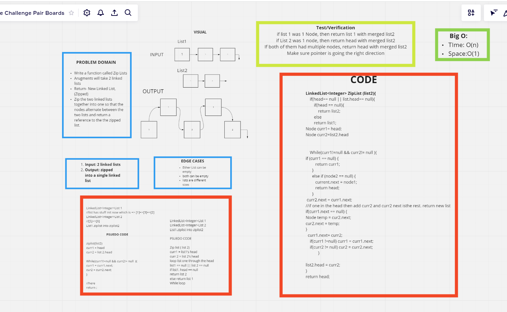
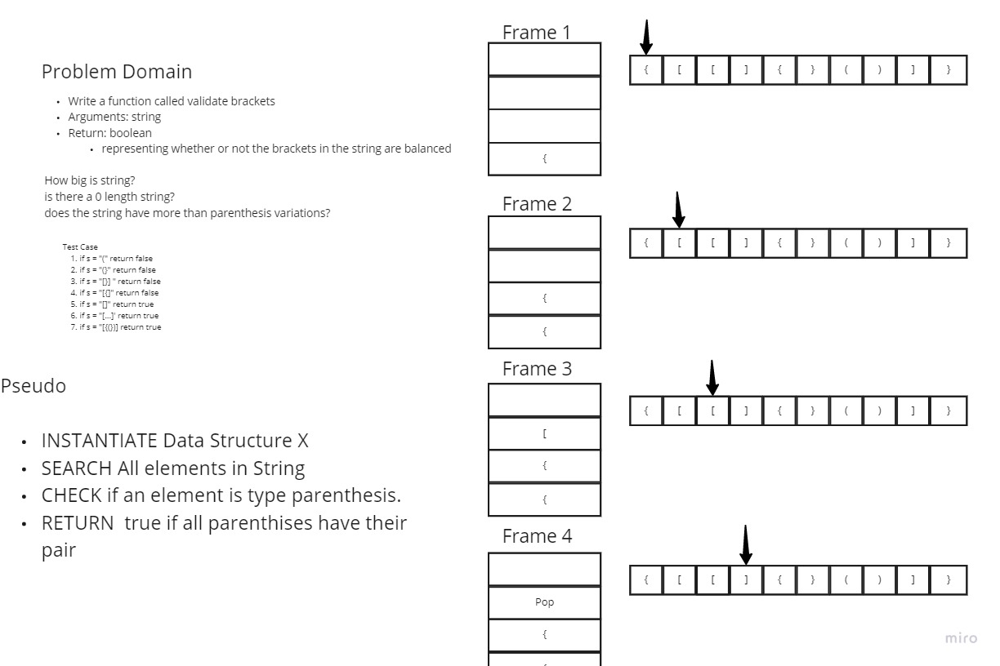
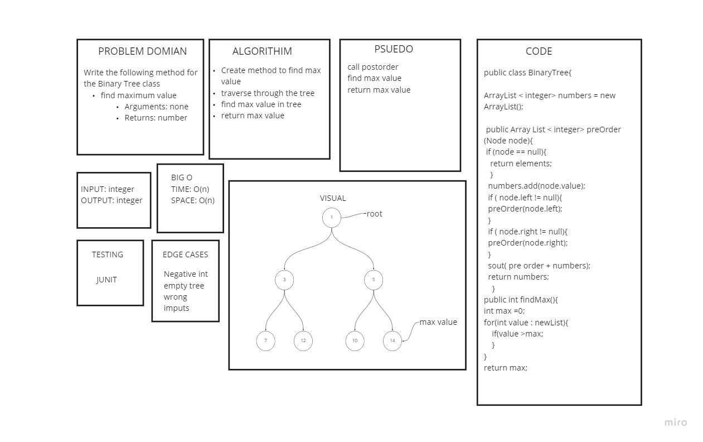

# Singly Linked List - Insert, toString, includes
- Created a singly linked list that inserts, Overrides toString, includes

## Challenge
- Code challenge 5 is intended to focus on implementation of Node class, and lInked list

## Approach & Efficiency
- I focused on using linked list for these implementations. especially insertion of a initial list.
- recursion wasn't as efficient. since insertion at the beginning is relatively fast, then O(n) was used
- space was O(1)

## API
- no api was used for this.

- [code challenge 5 location](app/src/main/java/linked/list)
# Singly Linked List - appends, insertBefore, insertAfter
- Created a singly linked list that appends, insertBefore, insertAfter.

## Challenge
- Code challenge 6 is intended to focus on implementation of insertion when traversing a list. the difficulty was to insert at beginning, middle, and end.
- recursion could have been used here but not needed.

## Approach & Efficiency
- I focused on using linked list for these implementations. especially insertion of a initial list.
- recursion wasn't as efficient. since insertion at the beginning is relatively fast, then O(n) was used
- space was O(1)

## API
- no api was used for this.

- [code challenge 6 location](app/src/main/java/linked/list)

# Challenge Summary
- Linked list return the value of the node  length - k in linkedlist.

## Whiteboard Process
No white board needed for process on today's lab. it seemed straight forward. especially iteratively.

## Approach & Efficiency
I solved it just subtracting the length - k and the time complexity is O(n) space O(1)
## Solution
running libraryTest will run tests. or create a static main and call the function in main.

- [code location](app/src/main/java/linked/list)

# Challenge Summary - 08
- merges unsorted linked lists and uses iteration.
## Whiteboard Process
<!-- Embedded whiteboard image -->

## Approach & Efficiency
- O(n + m) for time complexity since we are iterating two arrays and space complexity of O(1)
## Solution
- run test cases in case 1 and many
 
- [code challenge 08 location](app/src/main/java/linked/list)

# Stacks and Queues - 10
- adds a stack using lifo to pop and push, and a queue using enqueue and dequeue method
## Challenge
- [code challenge 10 - stack](../datastructures/lib/src/main/java/datastructures/stack/Stack.java)
- [code challenge 10 - queue](../datastructures/lib/src/main/java/datastructures/queue/Queue.java)
## Approach & Efficiency
- Time is O(n^2) since we use two loops for each data structure implementing a pop, push, enqueue, dequeue.
- Space is O(1) because we use memory to create nodes
## API
- no api used

#Challenge Summary - 11
- Pseudo Queue using Stacks to implement
- Code Challenge 11
## WhiteBoard Process
-
## Approach & Efficiency
- O(2N^2) using iteration and using pre implemented code, traversing to the end of the stack to remove an item takes N time. However, adding on T1 will have to use two loops
- the first loop will call on another function using pop() and Push() to t2, then inversely add popped items back to t1 from t2.
- time is still O(N) by creation of new memory
- [Code Challenge 11 - PseudoMerge](../datastructures/lib/src/main/java/datastructures/queue/PseudoQueue.java)

#Challenge Summary - 12
- Pseudo Queue using Stacks to implement the Animal Class
- Code Challenge 12
## WhiteBoard Process
  
## Approach & Efficiency
- O(2N^2) using iteration and using pre implemented code, traversing to the end of the stack to remove an item takes N time. However, adding on T1 will have to use two loops
- the first loop will call on another function using pop() and Push() to t2, then inversely add popped items back to t1 from t2.
- time is still O(N) by creation of new memory
- [Code Challenge 12 - Animal](../datastructures/lib/src/main/java/datastructures/animal/Animal.java)
- [Code Challenge 12 - AnimalShelter](../datastructures/lib/src/main/java/datastructures/animal/AnimalShelter.java)

#Challenge Summary - 13
- Write a function called validate brackets
- Arguments: string
- Return: boolean representing whether or not the brackets in the string are balanced
## WhiteBoard Process

-
## Approach & Efficiency
- I created three different algorithms. a bit more effiecient than the other.
- the final Validate is O(N) and Space O(N)
- using a search algorithm is always traversing to N (length N is dependant on our String passed in thus {1+2+...+N-1})
- since I use only iteration, then O(N) because loop breaks out if N < N-1. thus, O(N) + cO(1) .

- [Code Challenge 13(1) - ValidateParenthesis](../datastructures/lib/src/main/java/datastructures/validatebrackets/ValidateParenth.java)
- [Code Challenge 13(2) - ValidateParenthesis](../datastructures/lib/src/main/java/datastructures/validatebrackets/ValidateParenthesis.java)
- [Code Challenge 13(3) - ValidateParenthesis](../datastructures/lib/src/main/java/datastructures/validatebrackets/ValidParenth3.java)

#Challenge Summary -15
- Create a Node and BinaryTree and Binary Search tree that adds and displays preorder, post order, and inorder
## WhiteBoard Process

-
## Approach & Efficiency
- data structure only uses one recursive call which O(N). However, some implelmentation using finding and searching takes two recursive calls.
- therefor, it is O(2N) which is O(N)

- [Code Challenge 15 - Tnode](../datastructures/lib/src/main/java/datastructures/tree/Node.java)
- [Code Challenge 15 - BinaryTree](../datastructures/lib/src/main/java/datastructures/tree/BinaryTree.java)
- [Code Challenge 15 - BinarySearchTree](../datastructures/lib/src/main/java/datastructures/tree/BinarySearchTree.java)

#Challenge Summary - 14
- Find the max value in node of the Queue
## WhiteBoard Process

-
## Approach & Efficiency
- data structure only uses one iteration implemented by another function O(N). However, the wrapper function to push will
- do O(1) operations
- therefore, it is O(N) and recreating new nodes is O(N) space

#Challenge Summary - 16
- Find the maximum value stored in the tree. You can assume that the values stored in the Binary Tree will be numeric
## WhiteBoard Process

## Approach & Efficiency
- data structure only uses one iteration implemented by another function O(N). However, the wrapper function to push will
- do O(1) operations
- therefore, it is O(N) and recreating new nodes is O(N) space
- [Code Challenge 16 - ](../datastructures/lib/src/main/java/datastructures/tree/MaxTree.java)

